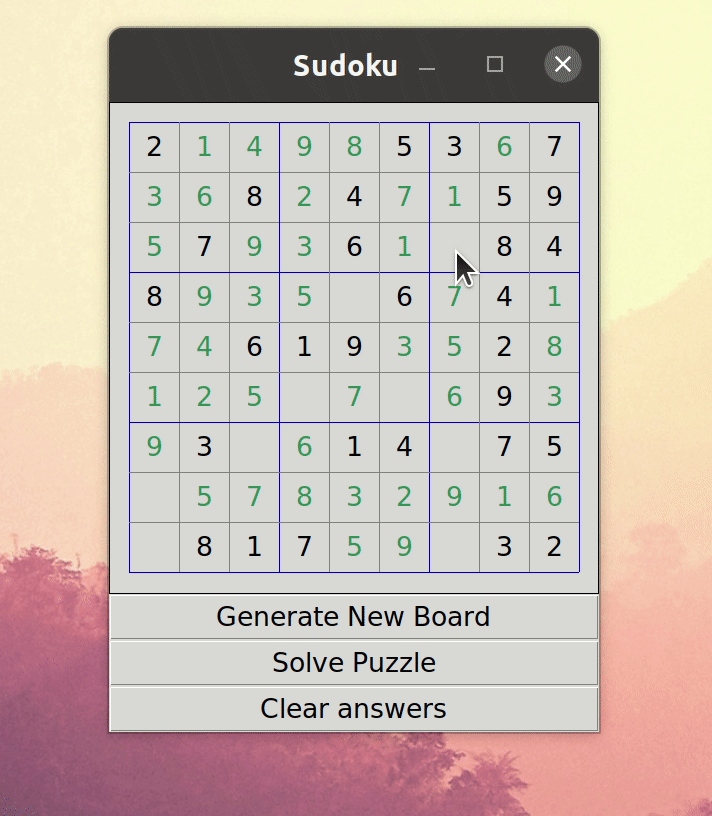
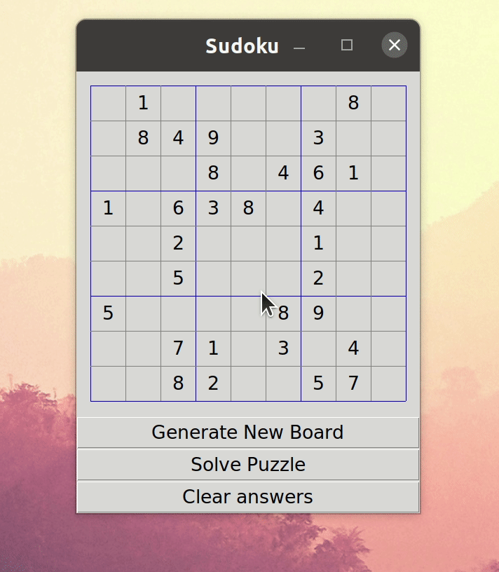

# Sudoku

My attempt at creating a working sudoku app by implementing a backtracking algorithm.  For the GUI I relied greatly on this tutorial: http://newcoder.io/gui/part-1/ using python's native tkinter library.  The app also has the ability to generate valid solvable pseudo-random sudoku boards.

 

